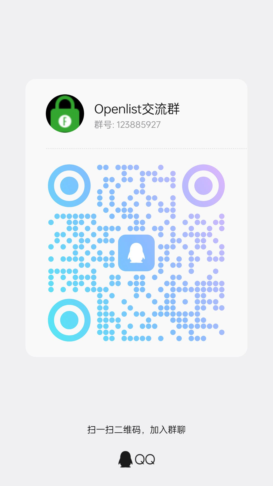

# OpenList MCP Server

<p align="center">
  
</p>

<p align="center">
  <a href="README.md">English</a> · <a href="README-zh.md">中文</a>
</p>

---

MCP Server for [OpenList](https://github.com/OpenListTeam/OpenList) — an open-source file management system (similar to Alist). Enables MCP-compatible AI agents to browse, upload, download, search, and manage files via the OpenList REST API.

```
┌────────────────┐     ┌────────────────────┐     ┌──────────────┐     ┌───────────────┐
│ Claude Desktop │────▶│ openlist-mcp-server │────▶│ OpenList API │────▶│ Storage (S3,  │
│   (or SOLO)    │ MCP │   (this project)    │ HTTP │   (your     │     │  SMB, Local,  │
└────────────────┘     └────────────────────┘     │   server)   │     │  ...)         │
                                                    └──────────────┘     └───────────────┘
```

## Features

- File browsing: list directories, get file details, search files
- File management: create folders, rename, copy, move, delete
- File transfer: upload base64 content, upload local files accessible to the MCP server, get download URLs
- Share management: create, list, cancel, delete share links
- Task management: list, retry, cancel, delete async tasks
- Auto authentication: JWT login and retry after token expiration

## Requirements

- Python 3.10+ (check with `python3 --version`)
- A running OpenList instance — this is a client, not a standalone service

## Installation

### From source

```bash
git clone https://github.com/hbestm/openlist-mcp-server.git
cd openlist-mcp-server

# (Recommended) Create and activate a virtual environment
python3 -m venv venv
source venv/bin/activate  # Linux/macOS
# venv\Scripts\activate   # Windows

pip install -e .
```

### From release zip

Download from [[GitHub Releases](https://github.com/hbestm/openlist-mcp-server/tags), then:

```bash
unzip openlist-mcp-server-*.zip
cd openlist-mcp-server-release
pip install -e .
```

### Verify installation

```bash
openlist-mcp
# Expected output:
# "OpenList MCP Server v0.2.2 installed successfully.
#  Set OPENLIST_URL, OPENLIST_USERNAME, and OPENLIST_PASSWORD to get started."
```

## Configuration

### Environment variables

```bash
export OPENLIST_URL="https://your-openlist-instance.example.com"
export OPENLIST_USERNAME="your_username"
export OPENLIST_PASSWORD="your_password"
```

You can also use a `.env` file (copy from `.env.example`):

```bash
cp .env.example .env
# Edit .env with your credentials
pip install python-dotenv   # required for .env support
```

The server automatically loads `.env` when `python-dotenv` is installed. **Never commit `.env` to Git** — the repository's `.gitignore` already excludes it.

### Security notes

- **Use HTTPS in production** — credentials are sent in plain text over HTTP.
- **Protect your MCP config file**:
  - Linux/macOS: `chmod 600 claude_desktop_config.json`
  - Windows: Right-click the file → Properties → Security → Remove all users except yourself.

## Usage

### Claude Desktop

1. Open Claude Desktop → Settings → **MCP Servers**.
2. Add a new server:

```json
{
  "mcpServers": {
    "openlist": {
      "command": "openlist-mcp",
      "env": {
        "OPENLIST_URL": "https://your-openlist-instance.example.com",
        "OPENLIST_USERNAME": "your_username",
        "OPENLIST_PASSWORD": "your_password"
      }
    }
  }
}
```

> **Config file locations:**
> - macOS: `~/Library/Application Support/Claude/claude_desktop_config.json`
> - Windows: `%APPDATA%\Claude\claude_desktop_config.json`
> - Linux: `~/.config/Claude/claude_desktop_config.json`

3. **Restart Claude Desktop** to load the new server.
4. Try a prompt: *"List the files on my OpenList server."*

### Example prompts to get started

| Goal | Prompt |
|------|--------|
| List root directory | *"List files in the root directory of my OpenList."* |
| Search files | *"Search for files named 'report' on OpenList."* |
| Upload a file | *"Upload this file to /documents on OpenList."* (Claude will ask for the file) |
| Get download link | *"Give me the download URL for /documents/report.pdf."* |
| Create a folder | *"Create a folder called 'archive' under /documents on OpenList."* |

### Direct stdio (debugging)

```bash
export OPENLIST_URL="https://your-openlist-instance.example.com"
export OPENLIST_USERNAME="your_username"
export OPENLIST_PASSWORD="your_password"
openlist-mcp
```

### SOLO / Other MCP clients

Same config format:

```json
{
  "mcpServers": {
    "openlist": {
      "command": "openlist-mcp",
      "env": {
        "OPENLIST_URL": "https://your-openlist-instance.example.com",
        "OPENLIST_USERNAME": "your_username",
        "OPENLIST_PASSWORD": "your_password"
      }
    }
  }
}
```

## Troubleshooting

| Problem | Likely cause | Solution |
|---------|-------------|----------|
| `OPENLIST_URL is required` | Environment variables not set | Set `OPENLIST_URL`, `OPENLIST_USERNAME`, `OPENLIST_PASSWORD` |
| `password is incorrect` | Wrong credentials | Verify your OpenList username and password |
| `Connection refused` | OpenList instance is down | Check that your OpenList server is running and reachable |
| Tool not found after install | PATH not updated or venv not activated | Re-activate your virtual environment or reinstall |
| MCP client shows "disconnected" | Claude Desktop needs restart | Restart Claude Desktop after adding the server config |
| `search not available` | Search index is disabled or backend doesn't support search | Enable OpenList search/indexing in admin settings first; storage backend must support search |
| Non-JSON response on task API | OpenList version mismatch | Some admin endpoints may not be exposed in your deployment |

**Enable debug logging:**

```bash
OPENLIST_URL=... OPENLIST_USERNAME=... OPENLIST_PASSWORD=... openlist-mcp 2>&1 | head -20
```

## Uninstall

```bash
pip uninstall openlist-mcp-server -y
rm -rf venv
```

## Tools

### Note for local file uploads

`upload_local_file` uploads a file from a path that the MCP server process can read. It is useful for local agents or server-side deployments. If the MCP server cannot access the user's local filesystem, use `upload_file` with base64 content instead.

### Authentication and public API

| Tool | Description |
|---|---|
| `login` | Login using configured credentials. Token is not printed. |
| `get_public_settings` | Get public OpenList settings without authentication. |

### File system

| Tool | Description |
|---|---|
| `list_files` | List files and folders in a directory. |
| `get_file_info` | Get detailed info for a file or folder. |
| `search_files` | Search files by keyword. Availability depends on OpenList storage/search support. |
| `create_folder` | Create a directory. |
| `rename` | Rename a file or folder. |
| `copy` | Copy files/folders to another directory. |
| `move` | Move files/folders to another directory. |
| `remove` | Delete files/folders. Requires `confirm=true`. |

### Transfer

| Tool | Description |
|---|---|
| `get_download_url` | Get direct/proxy download URL for a file. |
| `upload_file` | Upload base64-encoded file content. |
| `upload_local_file` | Upload a local file path readable by the MCP server process. |

### Tasks

| Tool | Description |
|---|---|
| `list_tasks` | List async tasks. Endpoint availability depends on OpenList version. |
| `delete_task` | Delete a task. Requires `confirm=true`. |
| `retry_task` | Retry a failed task. |
| `cancel_task` | Cancel a running task. Requires `confirm=true`. |

### Shares

| Tool | Description |
|---|---|
| `create_share` | Create a share link. |
| `list_shares` | List share links. |
| `cancel_share` | Disable a share link. Requires `confirm=true`. |
| `delete_share` | Permanently delete a share link. Requires `confirm=true`. |

> **Note on `names` parameter**: The `copy`, `move`, and `remove` tools use comma-separated file names. If a filename contains a comma, the tool cannot distinguish it — rename the file before operation.

## Integration tests

```bash
export OPENLIST_URL="https://your-openlist-instance.example.com"
export OPENLIST_USERNAME="your_username"
export OPENLIST_PASSWORD="your_password"
export OPENLIST_TEST_DIR="/"
PYTHONPATH=src python3 test_integration.py
```

The integration test creates a temporary directory under `OPENLIST_TEST_DIR` and removes it after the test. It never prints the password or token.

## Notes

- Search support depends on the OpenList backend/storage. Some servers return `search not available`.
- Some admin task endpoints may differ between OpenList versions and deployments.
- Destructive tools require an explicit `confirm=true` parameter to reduce accidental operations by AI agents.

---

## Community & Support

<p align="center">
  <a href="docs/qr-community.jpg">
    
  </a>
  <a href="docs/qr-sponsor.png">
    
  </a>
</p>

<p align="center">
  <strong>QQ 交流群</strong>&nbsp;&nbsp;&nbsp;&nbsp;&nbsp;&nbsp;&nbsp;&nbsp;&nbsp;&nbsp;&nbsp;&nbsp;&nbsp;&nbsp;&nbsp;&nbsp;&nbsp;&nbsp;&nbsp;&nbsp;
  <strong>微信赞助</strong>
</p>

For bugs, feature requests, or questions, please [open a GitHub Issue](https://github.com/hbestm/openlist-mcp-server/issues).

## License

MIT
